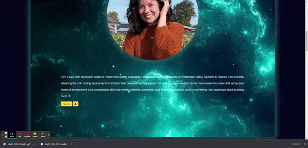
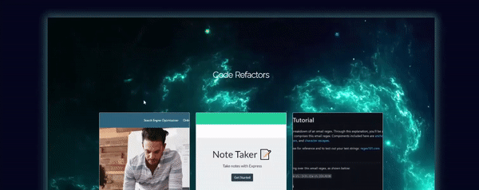
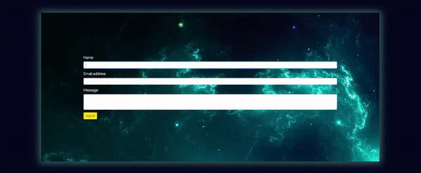

# GH-Portfolio-HTML-CSS-JS

Link to deployed application: https://humkeyg.github.io/GH-Portfolio-HTML-CSS-JS/

## Table of Contents

1. [Description](#Description)
2. [Installation](#Installation)
3. [Usage](#Usage)
4. [Tests](#Tests)
5. [Contributing](#Contributing)
6. [License](#License)
7. [Questions](#Questions)

## Description

A static website created using HTML, CSS, and JS. The CSS is done primarily with Bootstrap.

## Features
<<<<<<< HEAD

- The navigation menu contains drop-downs that bring the user to the corresponding heading.

- Features include a resume button that when clicked, shows a modal containing a jpeg image of the creator's resume. Next to it is a download button that automatically downloads a pdf to the user's computer when clicked.

- Cards have a hover effect, in which the user can click on the link and be redirected to a new page

- The contact form will automatically open the user's mail-client and fill in the corresponding information upon clicking 'submit'.
=======

-Features include a resume button that when clicked, shows a modal containing a jpeg image of the creator's resume. Next to it is a download button that automatically downloads a pdf to the user's computer when clicked.
https://media.giphy.com/media/5WiR2XHOHNG4U2uJIs/giphy.gif

-The navigation menu contains drop-downs that bring the user to the corresponding heading.
https://media.giphy.com/media/v3cwob4HHr88Jkcj3U/giphy.gif
>>>>>>> e377afeeb3acb0a74d41f1474481713ffe3070e1

## Installation

No installation necessary.

## Usage

Bootstrap styling is compatible with all mobile and desktop devices.

## Tests

## Contributing

Open to contributions.

## License

This application is covered under BSD.

## Questions

Please email me if you have further questions: 
(humkeyg@gmail.com).

Github:
[humkeyg](https://github.com/humkeyg)
